<div align="center">



<br/>

[](https://git.io/typing-svg)

**[🌐 Portfolio](https://imrevanth.netlify.app/)**

</div>

---

## 🚀 What I Build

I specialize in **AI-powered web tools** — things that are actually useful, not just portfolio padding.
My stack is TypeScript + React on the frontend, with LLMs doing the heavy lifting in the backend logic.

I'm a **vibe coder** — I use AI tools (Cursor, Claude, v0, etc.) to build faster than I could manually.
This isn't a shortcut. It's a skill. I know what to build, why to build it, and how to direct AI to ship it.

> *"The best developers in 2026 aren't the ones who memorize syntax — they're the ones who know what to ask for."*

---

## 🔨 Featured Projects

### relearn.ai — AI-powered learning ecosystem

An AI-driven learning platform that builds personalized study plans for each user instead of relying on generic course structures. The system breaks down learning goals into structured workflows, generates AI-assisted lessons tailored to pace and skill level, and tracks progress through a daily workspace so students always know what to work on next. Built to remove the guesswork from self-directed learning.

`TypeScript` · `React` · `LLM APIs`

[→ View repo](https://github.com/revanth-kumar-02/relearn.ai)

---

### Gradely — Room-based evaluation platform

A modern evaluation system built around collaborative assessment rooms instead of one-off grading. Supports three distinct role-based portals (student, teacher, admin), each with its own workflow, so peer reviews, multi-role evaluations, and real-time scoring all happen inside a shared dashboard architecture. Designed to make group assessments feel structured rather than chaotic.

`JavaScript` · `Real-time Systems` · `Dashboard Architecture`

[→ View repo](https://github.com/revanth-kumar-02/Gradely)

---

### LearnStation — Gamified learning platform

Takes the core idea of structured learning and wraps it in game mechanics — XP, achievement badges, streaks, and skill-based progression — so that completing coding challenges and interactive quests feels like leveling up rather than doing homework. Built on Supabase for persistent user progress and personalized learning paths that adapt as skills grow.

`TypeScript` · `React` · `Supabase` · `Gamification`

[→ View repo](https://github.com/revanth-kumar-02/Learn-Station)

---

### GitHub Companion — Developer workflow CLI

A Python-based command-line tool built to make everyday GitHub workflows faster. Pulls repository insights and contribution heatmaps directly into the terminal, cutting down the need to tab back to the browser for routine checks. Focused on small productivity wins that add up across a normal coding session.

`Python` · `GitHub API` · `CLI` · `Developer Tools`

[→ View repo](https://github.com/revanth-kumar-02/Github-Companion)

---

### Acadex — Native Android academic management app

A native Android app built with Kotlin and Jetpack Compose to give students one streamlined workspace for academic life — assignments, notes, deadlines, and other academic activity tracked in a single place instead of scattered across apps. Built with Material 3 for a clean, modern interface, and currently being pushed toward production-ready.

`Kotlin` · `Jetpack Compose` · `Android` · `Material 3`

[→ View repo](https://github.com/revanth-kumar-02/Acadex)

---

### ResolveHub — Hackathon-built in 24hrs (Vibe-Code T26)

An issue resolution and complaint management platform built solo under hackathon time pressure at Vibe-Code T26. Covers workflow tracking from issue submission to resolution, built fast as a working MVP rather than a polished long-term product — a good example of shipping under constraints rather than iterating endlessly.

`TypeScript` · `React` · `Workflow Systems`

[→ View repo](https://github.com/revanth-kumar-02/ResolveHub---Vibe-CodeT26)

---

## 📍 Right Now

```text
🔭 building   Acadex — making it production-ready
🌱 learning   full-stack architecture & LLM APIs
💼 seeking    internships in web dev / AI tooling
🤝 open to    collabs on AI-powered tools that solve real problems
```

---

## 🛠 Tech I Work With

**Languages & Frameworks**
<br/>


**AI & LLM Tools**
<br/>


**Infrastructure & Deployment**
<br/>


**Tools**
<br/>


---

## 📊 GitHub Stats

<div align="center">

<div align="center">


</div>

</div>

---

## 📬 Let's Talk

Got a project idea? I build fast with AI — let's ship it together.

**[revanthp0201@gmail.com](mailto:revanthp0201@gmail.com)** · **[Portfolio](https://imrevanth.netlify.app/)** · **[LinkedIn](https://www.linkedin.com/in/revanth-kumar02/)** · **[Discord](https://discord.gg/3KFBKMzz)**

---

<sub>Second-year student. Real projects. No fluff.</sub>
